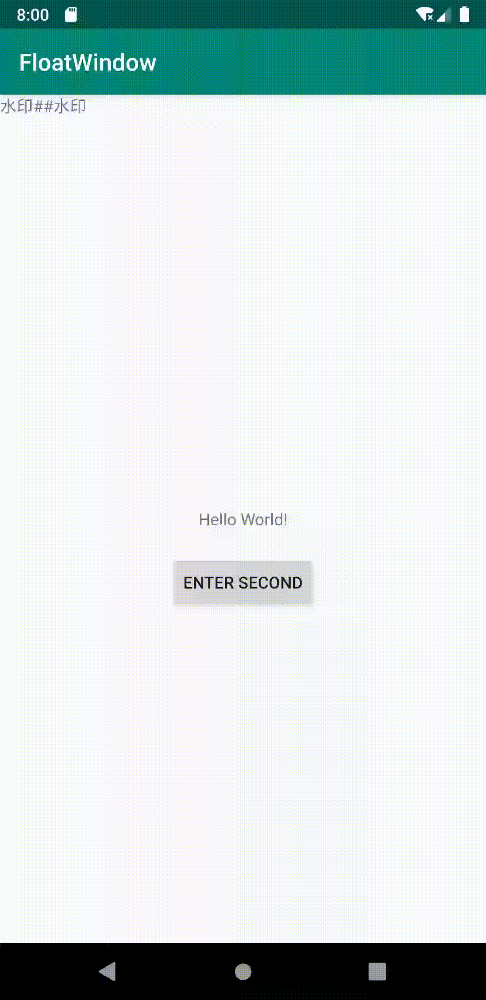

# FloatWindow

Android Float View in app.
#### App内全局悬浮窗,全局View

#### 快速接入

```groovy
repositories {
  jcenter()
}

dependencies {
  implementation 'tk.excaliburz:floatwindow:1.0.0'
}
```


#### 优点
* 无需申请权限,避免了复杂的rom和版本适配
* 默认实现了全局可拖拽,自动贴边 的悬浮球
* 可自定义悬浮球相关属性
* 可以添加任意view到全局的activity中(可以实现如全局水印,全局快捷入口等)
* 支持过滤页面,添加到指定的页面中
* 代码结构清晰,方便自定义和二次开发

#### 常见用法

* 在全局or部分页面添加一个悬浮球

  ```java
  	//在全局or部分页面添加一个悬浮球
          FloatWindow floatWindow = FloatWindow.INSTANCE.init(this);
          floatWindow.addDefault(R.drawable.ic_icon);
          floatWindow.setOnClickListener(new View.OnClickListener() {
              @Override
              public void onClick(View v) {
                  Toast.makeText(getApplicationContext(), "Click", Toast.LENGTH_SHORT).show();
              }
          });
          floatWindow.addFilter(new FloatWindow.FilterListener() {
              @Override
              public boolean needAdd(@NotNull Activity activity) {
                  return activity.getClass().getSimpleName().contains("Main");
              }
          });
  ```

  

* 添加一个自定义的View

  ```java
  		FloatWindow floatWindow = FloatWindow.INSTANCE.init(this);
  		TextView textView = new TextView(getApplicationContext());
          textView.setText("ABCABC");
  
          // FloatWindow.INSTANCE.addCustom(R.layout.layout_custom_test);
          
          FloatWindow.INSTANCE.addCustom(textView);
  ```

  

#### 截图


